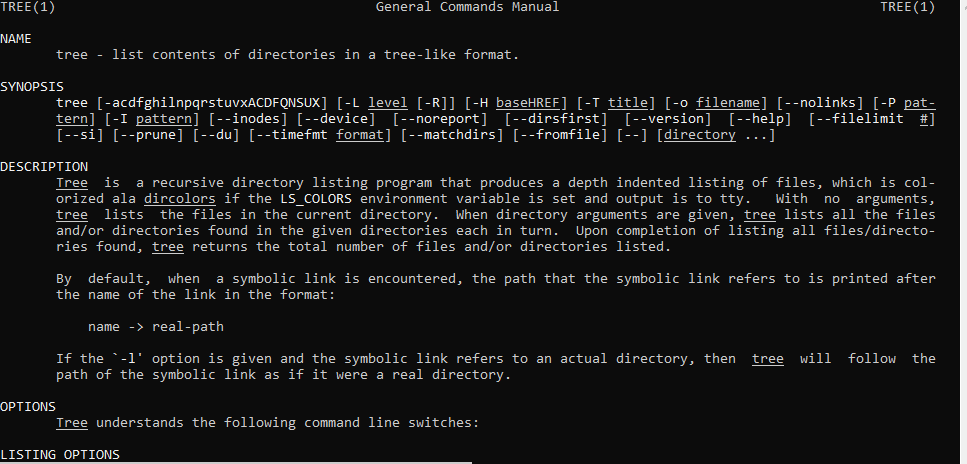
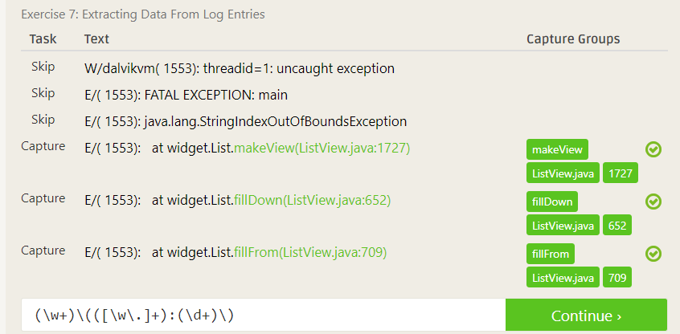

# Lab 01 Report - Introduction to Open Source Software
## Name: Covenant Faluyi (faluyc)
### email: faluyc@rpi,edu
### github account: TheCovenant
### discord handle: Kovenant (Kovenant#0067)

### 2 - Reading Assignments
**Eric Raymond's Article:**
One should never be afraid to ask a question. It is better to ask than not to ask.
Try to give examples in order to add context to the question you are asking.

**Free Culture Paragraph:**
It was very interesting to read about Jesse's experience with his search engine. What really struck me is that this experience happened here at RPI. The book says very clearly that Jesse's search engine did not offer any new features compared to Windows. The only major difference was a bug fix to make the user experience better. Despite this, the RIAA still came after him. I think an importnant lesson here is that releasing one's project for others to use can have unintended consequences. Not only this, but exposing software for usage can lead to the attention of companies who may try to shut it down.

### 3 - Linux

### 4 - Regex

### 5 - Blocky

### 6 - OSS Idea

An open source software that I feel I could contribute on is Quacs. A feature that I feel would be beneficial would be to enter what requirements one needs to graduate and be able to filter classes that will satisfy those requirements. I could contribute by cloning their github repo and working on commits and pull requests.
