# Lab 01 Report - Introduction to Open Source Software

### Message in general Discord channel

### Smart Questions How to Ask Questions the Smart Way
#### More Suggestions
1. Compile all your questions beforehand, so when you have a chance to meet with whoever's helping you, you can address them all at once. This will also prevent you from forgetting any questions you had.
2. When asking your question, provide some examples, or explain to them how they can recreate the issue.
3. This is similar to the "Choose your forum carefully" section of the article, but when I was working remotely from a different timezone than my team, I found it beneficial to ask simpler questions (ones that I knew would have a short response) through DMs and the more complex ones through a video call.

### Free Culture Chapter 3
Jesse Jordan used Microsoft's network file system to improve on RPI's search engine. The directory of this search engine supported all types of different files, but a fraction of them were music files. Jesse didn't intend for there to be so many music files, nor did he play any role in users adding music files. However, he was sued by the RIAA (Recording Industry Association of America) for violating copyright laws. They claimed that by operating his network, Jesse was pirating their music. It seems like a very unfair lawsuit, and the RIAA seemed to only be interested in taking away Jesse's money and platform. It's kind of unfortunate that large companies have so much power, and yet they still choose to pick fights with people who don't have the same amount of power. In fact, this happened to 3 other students as well. 

### Directory Structure
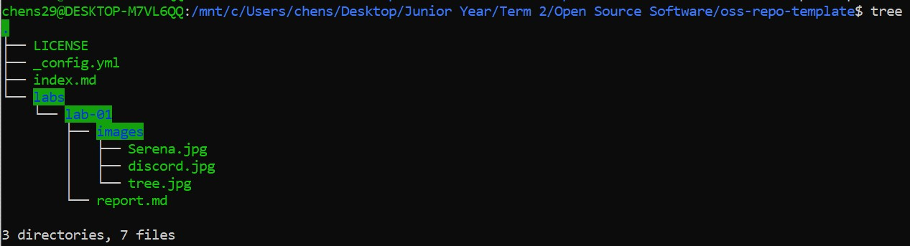

### Regex Practice
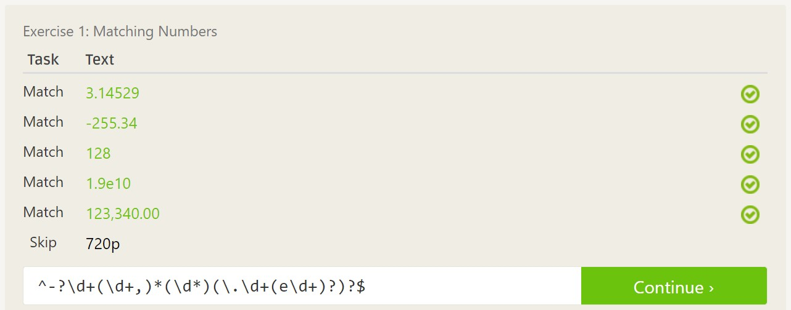
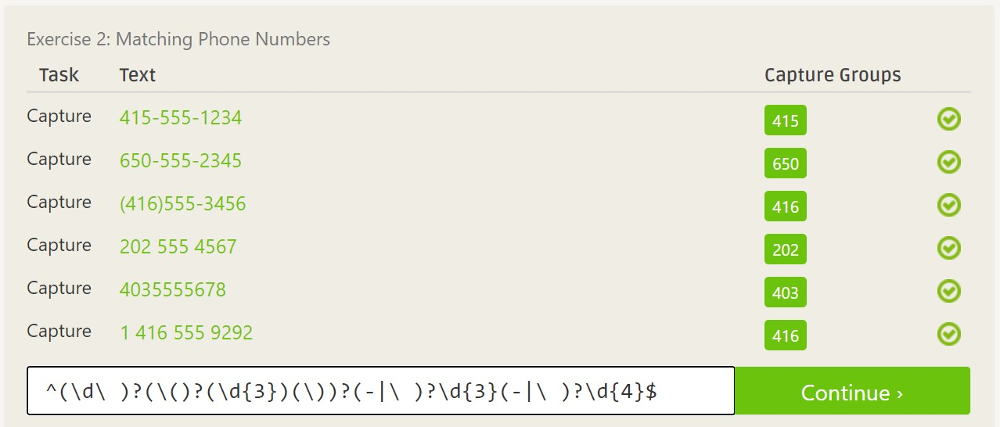
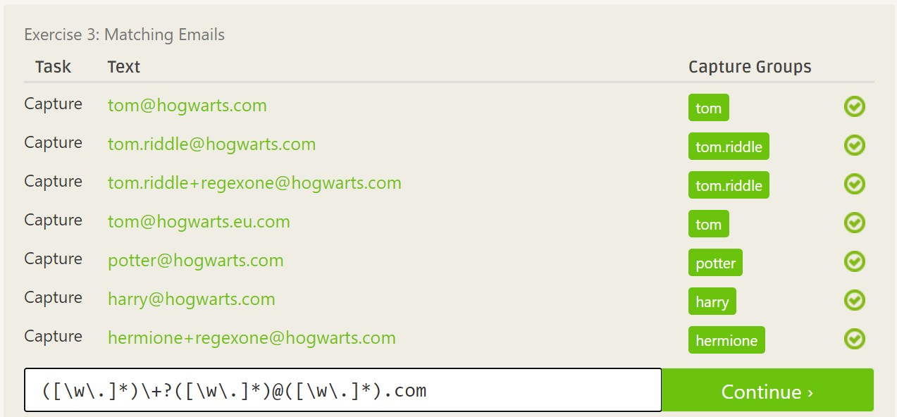
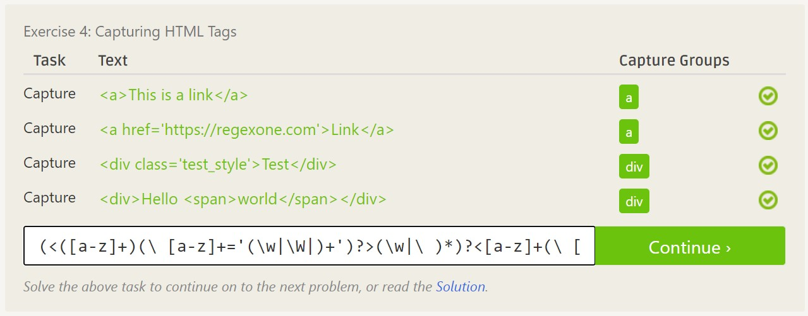
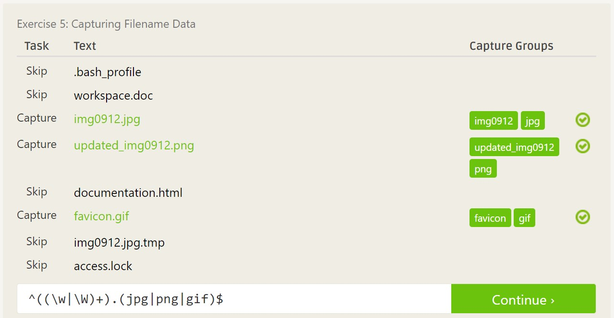

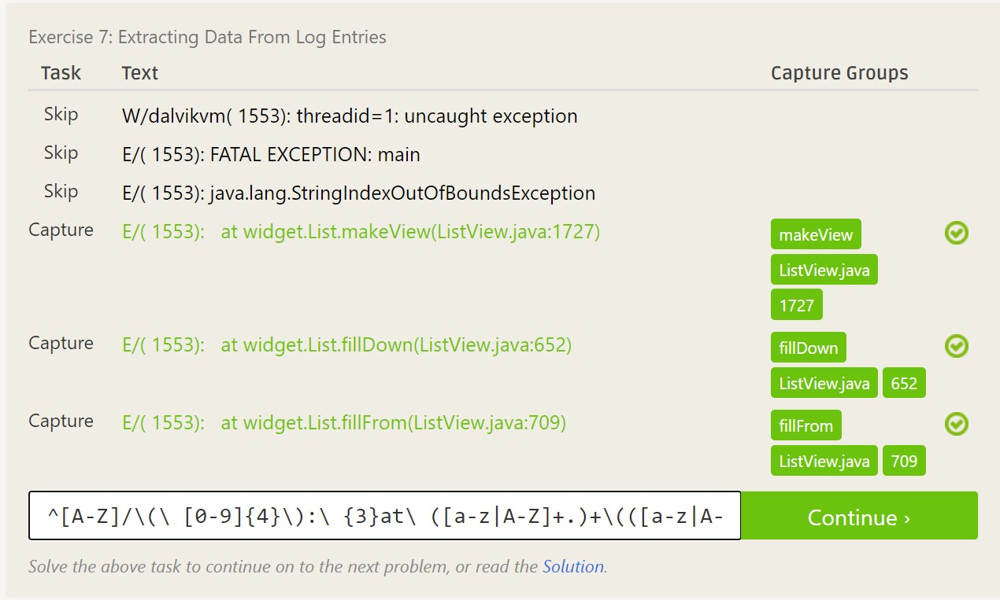

### Regex Crosswords
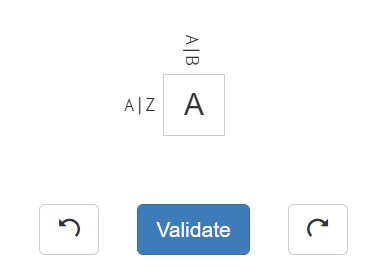
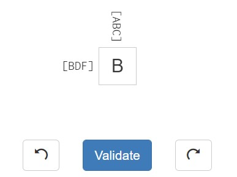
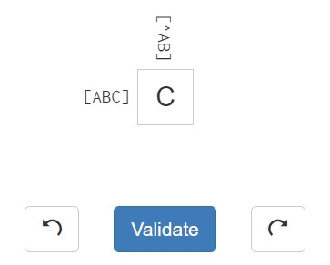
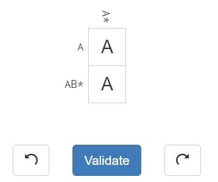

### Blockly Maze
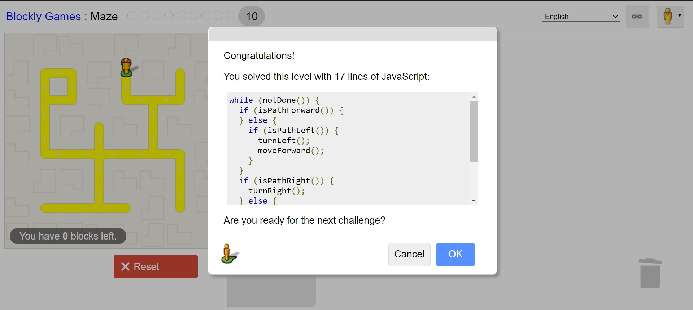
