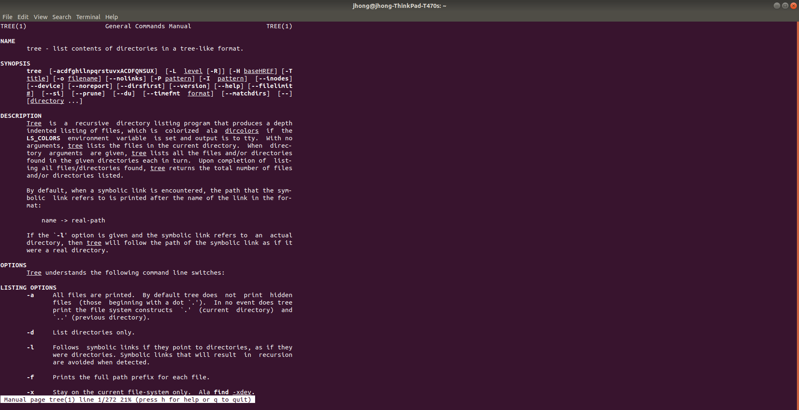

# Lab 01 Report - Introduction to Open Source Software

# 0

# 2
Suggestions for "How To Answer Questions in a Helpful Way":  
Suggestion 1 - In a workplace environment, if possible, try to ask questions in person instead of through an online medium.  
Suggestion 2 - Before you ask managers or other people in higher levels, ask your teammates for help first.  

Reaction to Chapter 3 of "Free Culture":  
My first impression after reading this chapter was how illogical the laws regarding copyright were. How was the RIAA able to sue and force Jesse to pay his entire savings over a problem that he had no control over? If Jesse was sued over this why weren’t companies like Google also being sued since they also allowed people to have access to pirated material? The RIAA are also an immoral company for going after someone who obviously didn’t create this project to help people who pirated music. This should have been obvious to the RIAA and they shouldn’t have pursued litigation. I believe that this was done to make Jesse an example and try to deter people from creating anything that is somehow related to the pirating of music. Another reason why the RIAA may have targeted Jesse is because it is probably a lot more difficult to target the actual pirates. When people pirate music they often take extra precaution when doing so and they do not announce that they are pirates. Jesse however probably did not.

# 3

#4
