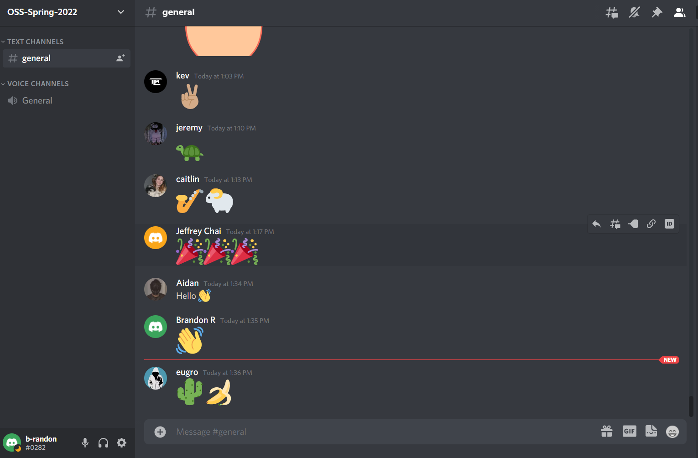

# Lab 01 Report - Introduction to Open Source Software

## 1. Discord Screenshot  
    

## 2. Readings  
  1. Smart Questions: How to ask the question The Smart Way  
  
     - Additions for Helpful Ways to Answer Questions
       - Most of the suggestions discussed in the article are similar to what I have thought. However, to elaborate more on the asking probing questions, I have found that in asking more questions both sides are better equipped to solve a problem, and the querent will have a better idea of what to ask themselves in the future when they come across a problem.
       - In addition to this, when answering a question, I've found that a more conceptual answer to less specific questions are better. This allows for the querent to understand the problem and the solution better, rather than finding an answer and applying it like a band aid, and will most likely come across the same problem again.

  2. Free Culture Reading Response

  > The chapter drew me in very fast when revealing that the main character was from a town right next to my hometown, as well as his enrollment to RPI. I found the development of the search engine to be very interesting due to my personal interest in networking and the fact that these technologies were being used in the early 2000s. Learning more about the state of technology in the early 2000s was eye opening and unlike my previous notions. I found Jesse's solution to be very simple, but made all the difference as it opened up the RPI search engine more than ever before. I was very upset to find out about how the rest of this story unfolded. I do not think it was fair at all that Jesse was to be at fault for the pirated music. He had not created any of the technologies, only making use of it. In addition he had no direct connection to the actual music that was pirated. It does make sense as to why he was blamed, but it was very upsetting considering his circumstances. This was a David vs. Goliath that was not worth fighting. The ethics and morals of the RIAA were very messed up to begin with and overall I was dissapointed in theri actions. After reading this I will have a more cautious thought process as to how to avoid situations simiar to this in the future.

## 3. Linux Tree
     

## 4. Regex
#### Practice Problems  
     
    
     
     
     
    
        
#### Crossword Problems    
     
     
     
     

## 5. Blockly Maze Solution   
    

## 6. Reflection

While scrolling through Github's collections of different code bases, I found [Music Time](https://github.com/swdotcom/swdc-vscode-musictime). I was very drawn to this as I love listening to music and always love finding new tools to improve my music listening. I would love to dive into their repository and see what features they have and see what makes it all work! I also noticed that they support Spotify, and having worked on a project that made use of the Spotify API I would like to see if I would be able to contribute to the project.

As for the rest of the activities in this lab, I learned a lot. Through doing all these exercises and playing these games I got some practice with regex which I have not touched since FOCs, and learned more about Linux and the terminal. This will greatly help my development in the future, as but not knowing it forces me to Google it and I get caught in the rabbit hole learning more and more about things like regular expressions, how its used and where its useful. In addition to cool terminal shortcuts and different ways to improve the efficiency of my use of the terminal.

