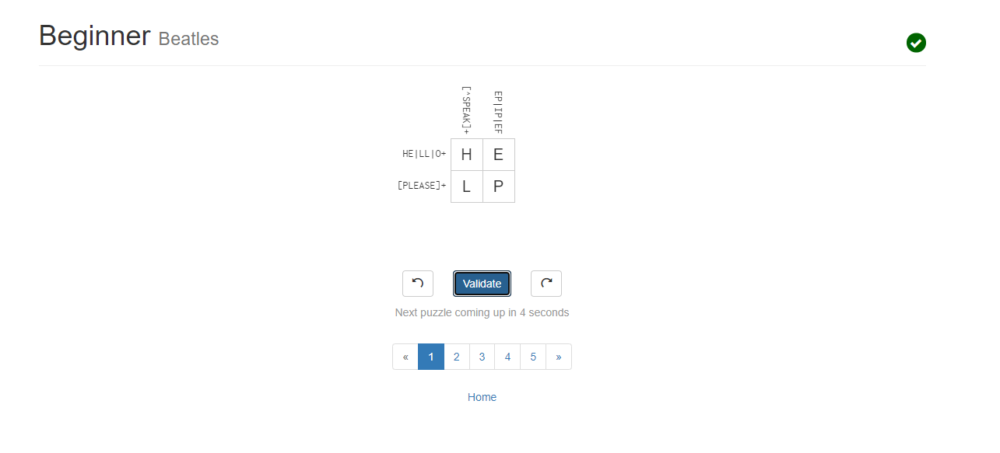
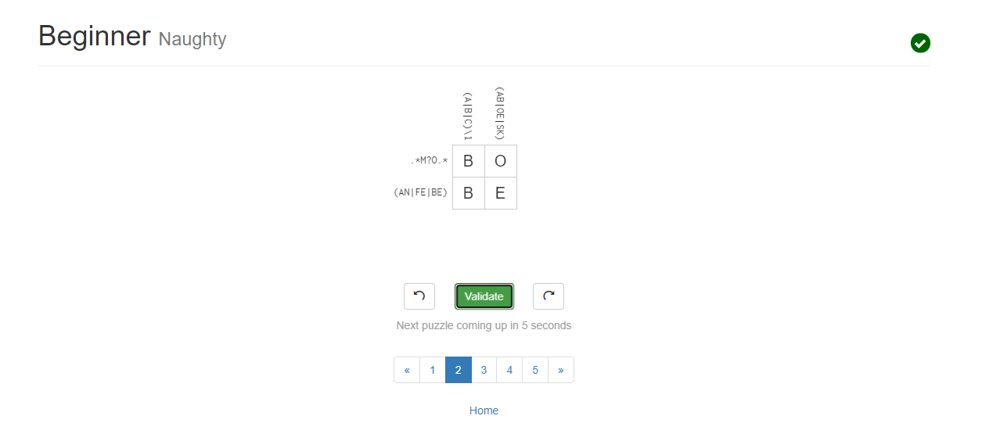
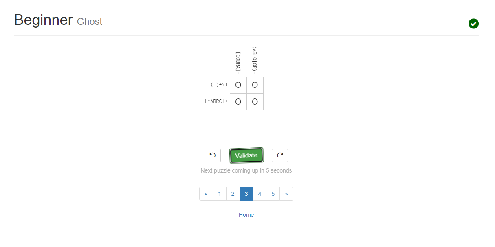

# Lab 01 Report - Introduction to Open Source Software

## Reading Assignment
More suggestions on how to answer questions in a helpful way:
1. Include as much detail as necessary to mitigate any potential confusion your answer may bring to others.
2. Reference things that the asker understands so they have something to mentally reference, ultimately increasing your answer's comprehension. (e.g To explain inheritence to someone, you could explain that Cows and Chicken are animals, so they inherit similar traits that animals have).

## Free Culture
After reading chapter 3 of Free Culture, it became clear to me the importance of respecting the copyrights set in place. In the case explained in chapter 3, Jesse Jordan only had a mere enthusiasm of how a technology worked. He wanted to see if he could create a search system that also routed through private files for everyone within that network. I would not have guess that this would be basis for a lawsuit by the RIAA in the figure of millions of dollars. It was not as if the natur eof the project Jordan was developing had a mission to pirate music, but inevitably, it provided grounds for others to do so, and he was held liable. What could have possibly prevented this was a strong Terms of Service that absolved him of any potential piracy, which would ultimately pass the responsibility onto the user who made the music public. But who knows.

## Regex
1. ^(-)?[0-9]+((,[0-9]+)*)*(\.[0-9]+)?((e){1}[0-9]+)?$
2. ([0-9]{3})
3. ([a-z]+(\.[a-z]+)*)
4. ([a-z]+)
5. ^(([a-z]*[_]*[0-9]*)*)\.((jpg|png|gif)?)$ 
6. ^(\s)*([a-zA-Z\s]+(\.)*)(\s)*$ 
7. ([a-zA-Z]+)(\()([a-zA-Z]+\.(java))(:)([0-9]+) 

## Regex Crossword
1. 
2. 
3. 
4. 

## Blocky
### Maze solution in Blocky

I solved this blocky maze by making my astronaut make every possible right turn, if there was a turn to be made, and move forward otherwise. They eventually made their way right to the goal!

## Reflection
I have had interest in numerous open source projects. 2 of those projects are flutter, the cross platform GUI development project and Godot, an open source game engine. The way I went about finding these open source projects are from prior knowledge of using these programs. After using flutter and godot, I was able to see that these were open source projects and I could contribute to advance its development. To find more open source projects that I may be interested in working on, I ma going through a list of known open source projects, checking out their github repositiories, and reading through their contribution and building guide which will help me get a look of what the project's environment is like. It is very important to look through the contribution guide of open source projects because following that guide is the only way any code you write on a project will be accepted to the stable build.
