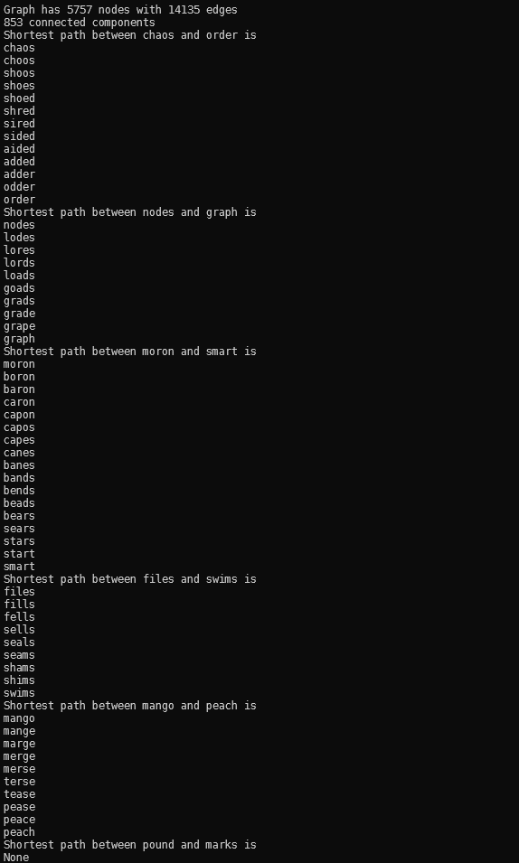
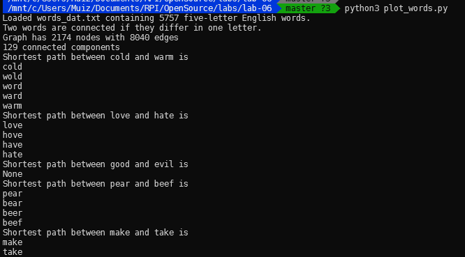
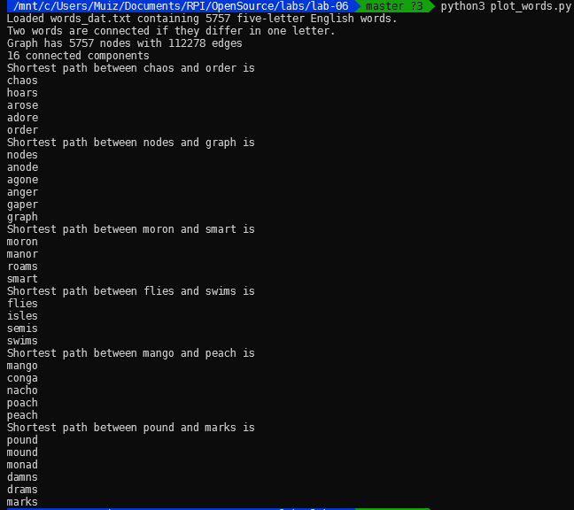

### Abdul-Muiz Yusuff
# Lab 6

## Part 1
### `plot_words.py`
``` python
"""
=====
Words
=====

Words/Ladder Graph
------------------
Generate  an undirected graph over the 5757 5-letter words in the
datafile `words_dat.txt.gz`.  Two words are connected by an edge
if they differ in one letter, resulting in 14,135 edges. This example
is described in Section 1.1 in Knuth's book (see [1]_ and [2]_).

References
----------
.. [1] Donald E. Knuth,
   "The Stanford GraphBase: A Platform for Combinatorial Computing",
   ACM Press, New York, 1993.
.. [2] http://www-cs-faculty.stanford.edu/~knuth/sgb.html
"""
# Authors: Aric Hagberg (hagberg@lanl.gov),
#          Brendt Wohlberg,
#          hughdbrown@yahoo.com

#    Copyright (C) 2004-2019 by
#    Aric Hagberg <hagberg@lanl.gov>
#    Dan Schult <dschult@colgate.edu>
#    Pieter Swart <swart@lanl.gov>
#    All rights reserved.
#    BSD license.

import gzip
from string import ascii_lowercase as lowercase

import networkx as nx

#-------------------------------------------------------------------
#   The Words/Ladder graph of Section 1.1
#-------------------------------------------------------------------


def generate_graph(words):
    G = nx.Graph(name="words")
    lookup = dict((c, lowercase.index(c)) for c in lowercase)

    def edit_distance_one(word):
        for i in range(len(word)):
            left, c, right = word[0:i], word[i], word[i + 1:]
            j = lookup[c]  # lowercase.index(c)
            for cc in lowercase[j + 1:]:
                yield left + cc + right
    candgen = ((word, cand) for word in sorted(words)
               for cand in edit_distance_one(word) if cand in words)
    G.add_nodes_from(words)
    for word, cand in candgen:
        G.add_edge(word, cand)
    return G


def words_graph():
    """Return the words example graph from the Stanford GraphBase"""
    fh = gzip.open('words_dat.txt.gz', 'r')
    words = set()
    for line in fh.readlines():
        line = line.decode()
        if line.startswith('*'):
            continue
        w = str(line[0:5])
        words.add(w)
    return generate_graph(words)


if __name__ == '__main__':
    G = words_graph()
    print("Loaded words_dat.txt containing 5757 five-letter English words.")
    print("Two words are connected if they differ in one letter.")
    print("Graph has %d nodes with %d edges"
          % (nx.number_of_nodes(G), nx.number_of_edges(G)))
    print("%d connected components" % nx.number_connected_components(G))

    for (source, target) in [('chaos', 'order'),
                             ('nodes', 'graph'),
                             ('moron', 'smart'),
                             ('files', 'swims'),
                             ('mango', 'peach'),
                             ('pound', 'marks')]:
        print("Shortest path between %s and %s is" % (source, target))
        try:
            sp = nx.shortest_path(G, source, target)
            for n in sp:
                print(n)
        except nx.NetworkXNoPath:
            print("None")

```



## Part 2
 
### `plot_words.py`
``` python
"""
=====
Words
=====
Words/Ladder Graph
------------------
Generate  an undirected graph over the 5757 5-letter words in the
datafile `words_dat.txt.gz`.  Two words are connected by an edge
if they differ in one letter, resulting in 14,135 edges. This example
is described in Section 1.1 in Knuth's book (see [1]_ and [2]_).
References
----------
.. [1] Donald E. Knuth,
   "The Stanford GraphBase: A Platform for Combinatorial Computing",
   ACM Press, New York, 1993.
.. [2] http://www-cs-faculty.stanford.edu/~knuth/sgb.html
"""
# Authors: Aric Hagberg (hagberg@lanl.gov),
#          Brendt Wohlberg,
#          hughdbrown@yahoo.com

#    Copyright (C) 2004-2019 by
#    Aric Hagberg <hagberg@lanl.gov>
#    Dan Schult <dschult@colgate.edu>
#    Pieter Swart <swart@lanl.gov>
#    All rights reserved.
#    BSD license.

import gzip
from string import ascii_lowercase as lowercase

import networkx as nx

#-------------------------------------------------------------------
#   The Words/Ladder graph of Section 1.1
#-------------------------------------------------------------------


def generate_graph(words):
    G = nx.Graph(name="words")
    lookup = dict((c, lowercase.index(c)) for c in lowercase)

    def edit_distance_one(word):
        for i in range(len(word)):
            left, c, right = word[0:i], word[i], word[i + 1:]
            j = lookup[c]  # lowercase.index(c)
            for cc in lowercase[j + 1:]:
                yield left + cc + right
    candgen = ((word, cand) for word in sorted(words)
               for cand in edit_distance_one(word) if cand in words)
    G.add_nodes_from(words)
    for word, cand in candgen:
        G.add_edge(word, cand)
    return G


def words_graph():
    """Return the words example graph from the Stanford GraphBase"""
    fh = gzip.open('words4_dat.txt.gz', 'r')
    words = set()
    for line in fh.readlines():
        line = line.decode()
        if line.startswith('*'):
            continue
        w = str(line[0:4])
        words.add(w)
    return generate_graph(words)


if __name__ == '__main__':
    G = words_graph()
    print("Loaded words_dat.txt containing 5757 five-letter English words.")
    print("Two words are connected if they differ in one letter.")
    print("Graph has %d nodes with %d edges"
          % (nx.number_of_nodes(G), nx.number_of_edges(G)))
    print("%d connected components" % nx.number_connected_components(G))

    for (source, target) in [('cold', 'warm'),
                             ('love', 'hate'),
                             ('good', 'evil'),
                             ('pear', 'beef'),
                             ('make', 'take')]:
        print("Shortest path between %s and %s is" % (source, target))
        try:
            sp = nx.shortest_path(G, source, target)
            for n in sp:
                print(n)
        except nx.NetworkXNoPath:
            print("None")
```



## Part 3

### `plot_words.py`
``` python
"""
=====
Words
=====
Words/Ladder Graph
------------------
Generate  an undirected graph over the 5757 5-letter words in the
datafile `words_dat.txt.gz`.  Two words are connected by an edge
if they differ in one letter, resulting in 14,135 edges. This example
is described in Section 1.1 in Knuth's book (see [1]_ and [2]_).
References
----------
.. [1] Donald E. Knuth,
   "The Stanford GraphBase: A Platform for Combinatorial Computing",
   ACM Press, New York, 1993.
.. [2] http://www-cs-faculty.stanford.edu/~knuth/sgb.html
"""
# Authors: Aric Hagberg (hagberg@lanl.gov),
#          Brendt Wohlberg,
#          hughdbrown@yahoo.com

#    Copyright (C) 2004-2019 by
#    Aric Hagberg <hagberg@lanl.gov>
#    Dan Schult <dschult@colgate.edu>
#    Pieter Swart <swart@lanl.gov>
#    All rights reserved.
#    BSD license.

import gzip
from string import ascii_lowercase as lowercase

import networkx as nx
import itertools
#-------------------------------------------------------------------
#   The Words/Ladder graph of Section 1.1
#-------------------------------------------------------------------


def generate_graph(words):
    G = nx.Graph(name="words")
    lookup = dict((c, lowercase.index(c)) for c in lowercase)

    def edit_distance_one(word):
        for i in range(len(word)):
            left, c, right = word[0:i], word[i], word[i + 1:]
            j = lookup[c]  # lowercase.index(c)
            for cc in lowercase[j + 1:]:
                temp = left+cc+right
                for i in itertools.permutations(temp):
                    yield "".join(i)
    candgen = ((word, cand) for word in sorted(words)
               for cand in edit_distance_one(word) if cand in words)
    G.add_nodes_from(words)
    for word, cand in candgen:
        G.add_edge(word, cand)
    return G


def words_graph():
    """Return the words example graph from the Stanford GraphBase"""
    fh = gzip.open('words_dat.txt.gz', 'r')
    words = set()
    for line in fh.readlines():
        line = line.decode()
        if line.startswith('*'):
            continue
        w = str(line[0:5])
        words.add(w)
    return generate_graph(words)


if __name__ == '__main__':
    G = words_graph()
    print("Loaded words_dat.txt containing 5757 five-letter English words.")
    print("Two words are connected if they differ in one letter.")
    print("Graph has %d nodes with %d edges"
          % (nx.number_of_nodes(G), nx.number_of_edges(G)))
    print("%d connected components" % nx.number_connected_components(G))

    for (source, target) in [('chaos', 'order'),
                             ('nodes', 'graph'),
                             ('moron', 'smart'),
                             ('flies', 'swims'),
                             ('mango', 'peach'),
                             ('pound', 'marks')]:
        print("Shortest path between %s and %s is" % (source, target))
        try:
            sp = nx.shortest_path(G, source, target)
            for n in sp:
                print(n)
        except nx.NetworkXNoPath:
            print("None")
```

